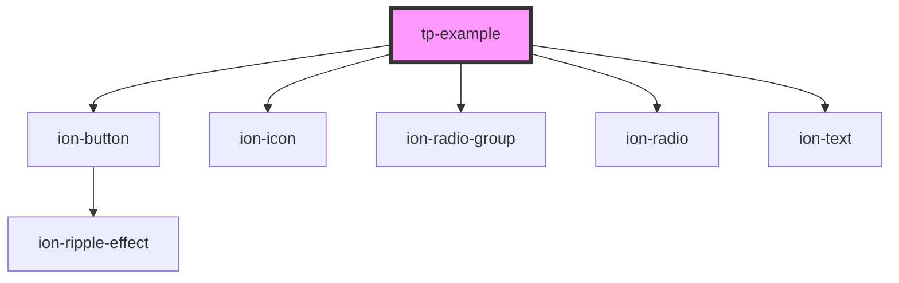

# tp-example

<!-- Auto Generated Below -->

## Properties

| Property | Attribute | Description | Type                                                                                                                                                | Default     |
| -------- | --------- | ----------- | --------------------------------------------------------------------------------------------------------------------------------------------------- | ----------- |
| `color`  | `color`   |             | `"orange" \| "orange-1" \| "orange-2" \| "orange-3" \| "orange-4" \| "orange-5" \| TpColors \| TpColorsMedgrupo \| (string & Record<never, never>)` | `undefined` |
| `icon`   | `icon`    |             | `string`                                                                                                                                            | `undefined` |

## Dependencies

### Depends on

- ion-button
- ion-icon
- ion-radio-group
- ion-radio
- ion-text

### Graph

----------------------------------------------

*Built with [StencilJS](https://stenciljs.com/)*
